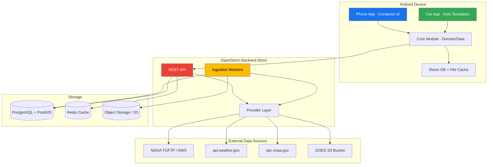

# OpenStorm — Product & Technical Plan

## 1. Executive Summary

**OpenStorm** is an original, open-data-first weather radar application for Android phones, tablets, and Android Auto. It provides professional-grade storm analysis tools powered primarily by free public data from NOAA, NWS, SPC, and GOES. Commercial data sources (lightning, premium derived products) are supported via pluggable provider interfaces but not assumed.

**Key differentiators:**
- Android Auto-native weather radar experience (no existing app does this well)
- Open-data-first philosophy with transparent data attribution
- Professional meteorology aesthetic without cloning any existing product
- Modular provider architecture enabling community and commercial extensions
- Low-bandwidth optimized with aggressive caching and delta updates

**Tech stack:** Kotlin/Compose (Android), Kotlin/Ktor (backend), PostgreSQL/PostGIS + Redis, MapLibre for rendering, GitHub Actions CI/CD.

**Business model assumption:** Free for open-data features. Optional one-time purchase for premium UI features (dual-pane, archive deep history). No subscription unless commercial data licensing requires it.

---

## 2. Product Scope Table

| Feature | MVP (Phase 1) | Phase 2 | Phase 3 |
|---|---|---|---|
| Live NEXRAD radar (Level III tiles) | ✅ | | |
| Nearest-radar auto-selection | ✅ | | |
| Radar station picker | ✅ | | |
| Base reflectivity product | ✅ | | |
| Velocity product | ✅ | | |
| Loop playback (last 1hr) | ✅ | | |
| NWS alerts/watches/warnings overlay | ✅ | | |
| Dark/light mode auto-switch | ✅ | | |
| Android Auto basic radar card | ✅ | | |
| Android Auto alerts list | ✅ | | |
| Offline caching | ✅ | | |
| Multiple radar products (CC, KDP, etc.) | | ✅ | |
| SPC convective outlooks overlay | | ✅ | |
| SPC mesoscale discussions | | ✅ | |
| Local storm reports overlay | | ✅ | |
| GOES satellite layer | | ✅ | |
| National mosaic view | | ✅ | |
| Favorites & preferences sync | | ✅ | |
| Sounding chart display | | | ✅ |
| Archive playback (deep history) | | | ✅ |
| Route-aware weather corridor | | | ✅ |
| Dual-pane compare mode | | | ✅ |
| Lightning provider (commercial) | | | ✅ |
| Tablet adaptive layout | | | ✅ |

### Data Source Classification

| Data Source | Status | Notes |
|---|---|---|
| NEXRAD Level III (NOAA) | ✅ Open, free | Via NOAA TGFTP/AWS OpenData |
| NWS Alerts API | ✅ Open, free | api.weather.gov |
| SPC Products (outlooks, MDs) | ✅ Open, free | spc.noaa.gov |
| GOES Imagery (NOAA) | ✅ Open, free | Via AWS S3 public bucket |
| Local Storm Reports (SPC) | ✅ Open, free | CSV/filtered feed |
| Sounding Data (RAOB) | ✅ Open, free | Via University of Wyoming or NOAA |
| NEXRAD Level II (raw) | ⚠️ Backend-heavy | AWS S3 public, but needs server-side processing |
| MRMS Mosaic | ⚠️ Backend-heavy | NOAA public, large tiles need pre-processing |
| Lightning (GLM satellite) | ⚠️ Partial open | GOES GLM is public but low-res; hi-res networks are commercial |
| Lightning (Vaisala/ENTLN) | ❌ Commercial | Requires licensing |
| Premium derived products | ❌ Commercial | Rotation tracks, hail estimates from commercial vendors |

---

## 3. Legal and Compliance Guardrails

1. **NOAA/NWS data** is public domain (17 USC §105). Free to use with attribution. Must not imply NWS endorsement.
2. **Do not rebroadcast NWS alerts as official warnings.** Display with "Source: National Weather Service" attribution.
3. **Map tiles:** MapLibre + OpenFreeMap/Protomaps tiles (ODbL license). Attribution required in UI.
4. **Android Auto:** Must comply with Car App Library template constraints. No freeform Canvas rendering while driving. Use `PlaceListMapTemplate`, `NavigationTemplate` (if navigation category), or `MessageTemplate`.
5. **GOES imagery:** Public domain via NOAA. Attribute "NOAA/NESDIS."
6. **Lightning:** Do NOT ship with any commercial lightning data. Provider interface only. Feature-flagged OFF by default.
7. **App store:** Google Play weather category. No misleading claims about alert accuracy.
8. **Privacy:** Location used for nearest-radar. Collect minimum data. No analytics without consent. GDPR/CCPA safe defaults.
9. **No trademark infringement:** Original name "OpenStorm," original iconography, no visual similarity to RadarScope, MyRadar, or others.

---

## 4. System Architecture



### Backend Decision: Kotlin/Ktor

**Why Ktor over Node/TypeScript:**
- Same language as Android app — shared domain models possible via Kotlin Multiplatform later
- Excellent coroutine support for concurrent data ingestion
- Type safety across the stack
- Ktor is lightweight, fast startup, easy to deploy as a single JAR
- Solo dev benefits from one language to maintain

**API Style: REST (not GraphQL)**
- Weather data is read-heavy with predictable shapes
- REST is simpler to cache at CDN/Redis layer
- GraphQL adds complexity without proportional benefit for this domain
- Fewer dependencies, faster to build

**Auth: Anonymous local-first for MVP**
- No login required. Preferences stored locally in Room.
- Phase 2: Optional account with email magic link for cross-device sync.

---

## 5. Repository / Folder Tree

```
OpenStorm/
├── android/                          # Android application
│   ├── build.gradle.kts              # Root Android build
│   ├── settings.gradle.kts
│   ├── gradle.properties
│   ├── gradle/
│   │   └── libs.versions.toml        # Version catalog
│   ├── app/                          # Main app module
│   │   ├── build.gradle.kts
│   │   └── src/main/
│   │       ├── AndroidManifest.xml
│   │       ├── kotlin/com/openstorm/app/
│   │       │   ├── OpenStormApp.kt
│   │       │   ├── MainActivity.kt
│   │       │   ├── di/              # Hilt modules
│   │       │   ├── ui/
│   │       │   │   ├── theme/       # Material3 theme
│   │       │   │   ├── radar/       # Radar screen
│   │       │   │   ├── alerts/      # Alerts screen
│   │       │   │   ├── stations/    # Station picker
│   │       │   │   └── settings/    # Settings screen
│   │       │   └── navigation/      # Nav graph
│   │       └── res/
│   ├── core/                         # Core domain + data module
│   │   ├── build.gradle.kts
│   │   └── src/main/kotlin/com/openstorm/core/
│   │       ├── domain/
│   │       │   ├── model/           # Domain models
│   │       │   └── repository/      # Repository interfaces
│   │       ├── data/
│   │       │   ├── repository/      # Repository implementations
│   │       │   ├── remote/          # API client
│   │       │   ├── local/           # Room DAOs + DB
│   │       │   └── cache/           # Cache manager
│   │       └── provider/            # Provider interfaces
│   │           ├── RadarProvider.kt
│   │           ├── AlertProvider.kt
│   │           ├── SatelliteProvider.kt
│   │           ├── LightningProvider.kt
│   │           └── SoundingProvider.kt
│   ├── auto/                         # Android Auto module
│   │   ├── build.gradle.kts
│   │   └── src/main/
│   │       ├── AndroidManifest.xml
│   │       ├── kotlin/com/openstorm/auto/
│   │       │   ├── OpenStormCarAppService.kt
│   │       │   ├── OpenStormSession.kt
│   │       │   ├── screen/
│   │       │   │   ├── MainCarScreen.kt
│   │       │   │   ├── AlertsCarScreen.kt
│   │       │   │   └── RadarCarScreen.kt
│   │       │   └── di/
│   │       └── res/
│   └── shared-test/                  # Shared test utilities
├── backend/                          # Ktor backend
│   ├── build.gradle.kts
│   ├── settings.gradle.kts
│   ├── gradle/
│   │   └── libs.versions.toml
│   └── src/
│       ├── main/kotlin/com/openstorm/backend/
│       │   ├── Application.kt
│       │   ├── config/
│       │   │   └── AppConfig.kt
│       │   ├── routes/
│       │   │   ├── HealthRoutes.kt
│       │   │   ├── RadarRoutes.kt
│       │   │   └── AlertRoutes.kt
│       │   ├── provider/
│       │   │   ├── radar/
│       │   │   │   ├── RadarProvider.kt
│       │   │   │   └── NoaaRadarProvider.kt
│       │   │   ├── alert/
│       │   │   │   ├── AlertProvider.kt
│       │   │   │   └── NwsAlertProvider.kt
│       │   │   └── satellite/
│       │   │       ├── SatelliteProvider.kt
│       │   │       └── GoesSatelliteProvider.kt
│       │   ├── model/
│       │   │   ├── RadarStation.kt
│       │   │   ├── RadarProduct.kt
│       │   │   ├── Alert.kt
│       │   │   └── ApiResponse.kt
│       │   ├── ingestion/
│       │   │   └── RadarIngestionWorker.kt
│       │   └── service/
│       │       ├── RadarService.kt
│       │       └── AlertService.kt
│       └── test/kotlin/com/openstorm/backend/
│           ├── routes/
│           └── provider/
├── .github/
│   └── workflows/
│       ├── android-ci.yml
│       └── backend-ci.yml
├── docs/
│   ├── architecture.md
│   └── api-contracts.md
├── PLAN.md
├── LICENSE
└── README.md
```

---

## 6. Domain Models

### RadarStation
```
id: String (ICAO, e.g. "KTLX")
name: String ("Oklahoma City")
lat: Double
lon: Double
elevation: Double (meters)
stationType: Enum (WSR88D, TDWR)
status: Enum (ACTIVE, DOWN, MAINTENANCE)
```

### RadarProduct
```
stationId: String
productCode: String ("N0Q", "N0U", "N0C", etc.)
productName: String ("Base Reflectivity", "Base Velocity")
timestamp: Instant
tileUrl: String
expiresAt: Instant
```

### Alert
```
id: String (NWS alert ID)
type: Enum (WARNING, WATCH, ADVISORY, STATEMENT)
event: String ("Tornado Warning", "Severe Thunderstorm Watch")
headline: String
description: String
areaDesc: String
geometry: GeoJSON polygon
effective: Instant
expires: Instant
severity: Enum (EXTREME, SEVERE, MODERATE, MINOR, UNKNOWN)
certainty: Enum (OBSERVED, LIKELY, POSSIBLE, UNLIKELY, UNKNOWN)
senderName: String
```

### RadarFrame (for loop playback)
```
stationId: String
product: String
timestamp: Instant
imageUrl: String
```

---

## 7. API Contract Examples

### GET /api/v1/health
```json
{ "status": "ok", "version": "1.0.0", "uptime": 3600 }
```

### GET /api/v1/radar/stations?lat=35.2&lon=-97.4&radius=200
```json
{
  "stations": [
    {
      "id": "KTLX",
      "name": "Oklahoma City",
      "lat": 35.3331,
      "lon": -97.2778,
      "distanceKm": 15.2,
      "status": "ACTIVE",
      "products": ["N0Q", "N0U", "N0C", "N0K", "N0X"]
    }
  ]
}
```

### GET /api/v1/radar/stations/{stationId}/products/{product}?frames=10
```json
{
  "station": "KTLX",
  "product": "N0Q",
  "frames": [
    {
      "timestamp": "2026-03-06T18:00:00Z",
      "tileUrl": "https://cdn.openstorm.app/tiles/KTLX/N0Q/20260306T180000Z/{z}/{x}/{y}.png",
      "expiresAt": "2026-03-06T18:10:00Z"
    }
  ]
}
```

### GET /api/v1/alerts?lat=35.2&lon=-97.4&radius=150
```json
{
  "alerts": [
    {
      "id": "urn:oid:2.49.0.1.840.0.abc",
      "type": "WARNING",
      "event": "Tornado Warning",
      "headline": "Tornado Warning issued for Cleveland County",
      "severity": "EXTREME",
      "certainty": "OBSERVED",
      "effective": "2026-03-06T17:45:00Z",
      "expires": "2026-03-06T18:15:00Z",
      "geometry": { "type": "Polygon", "coordinates": [[...]] }
    }
  ]
}
```

---

## 8. Android Module Breakdown

| Module | Purpose | Dependencies |
|---|---|---|
| `:app` | Phone UI, navigation, Hilt setup | `:core`, `:auto` |
| `:core` | Domain models, repositories, providers, Room DB, API client | Retrofit, Room, Hilt |
| `:auto` | Android Auto screens and service | `:core`, Car App Library |
| `:shared-test` | Test fakes, fixtures | `:core` |

---

## 9. Android Auto Screen/Template Plan

Android Auto enforces template-based UIs. No custom Canvas while driving.

| Screen | Template | Content | Interaction |
|---|---|---|---|
| Main | `PlaceListMapTemplate` | Map centered on user + nearest radar coverage indicator | Tap station → radar detail |
| Alerts List | `ListTemplate` | Active alerts sorted by severity | Tap → alert detail |
| Alert Detail | `LongMessageTemplate` | Full alert text | Back button |
| Radar Status | `PaneTemplate` | Current radar station info, last update time, product | Switch product button |
| Settings | `ListTemplate` | Radar station override, units | Tap to toggle |

**Driver distraction compliance:**
- Max 6 list items visible
- No scrolling lists longer than allowed by Car App Library
- No animation or rapid updates
- Text size minimum enforced by templates
- Actions limited to 2 per row

---

## 10. Data Ingestion Plan

### Radar Tiles
1. Backend polls NOAA TGFTP (`tgftp.nws.noaa.gov/SL.us008001/`) every 2-5 minutes per active station
2. Downloads Level III product files (e.g., N0Q)
3. Decodes using `netcdf-java` or custom binary parser
4. Renders to 256x256 PNG tiles at standard zoom levels
5. Stores tiles in S3-compatible object storage (MinIO for self-hosted)
6. Redis tracks latest frame timestamps per station/product

### Alternative: Direct NEXRAD on AWS
- `s3://noaa-nexrad-level2/` has real-time Level II data
- More data but requires heavier processing
- Phase 2: Use for higher-resolution products

### Alerts
1. Poll `api.weather.gov/alerts/active` every 60 seconds
2. Parse CAP/ATOM XML or JSON
3. Store in PostgreSQL with PostGIS geometry
4. Serve via REST with spatial queries

### Low-Bandwidth Optimization
- ETag/If-Modified-Since on all tile requests
- WebP tiles (40% smaller than PNG) with PNG fallback
- Tile pyramid: serve lower zoom levels first
- Client requests only visible viewport tiles
- Delta frame encoding for loops (only changed tiles)
- Aggressive `Cache-Control` headers (radar tiles valid for 5-10 min)
- GZIP all JSON responses

---

## 11. Storage Schema (PostgreSQL + PostGIS)

```sql
CREATE TABLE radar_stations (
    id VARCHAR(4) PRIMARY KEY,   -- ICAO code
    name TEXT NOT NULL,
    location GEOGRAPHY(POINT, 4326) NOT NULL,
    elevation DOUBLE PRECISION,
    station_type VARCHAR(10),
    status VARCHAR(20) DEFAULT 'ACTIVE',
    updated_at TIMESTAMPTZ DEFAULT NOW()
);

CREATE TABLE radar_frames (
    id BIGSERIAL PRIMARY KEY,
    station_id VARCHAR(4) REFERENCES radar_stations(id),
    product VARCHAR(10) NOT NULL,
    captured_at TIMESTAMPTZ NOT NULL,
    tile_base_url TEXT NOT NULL,
    expires_at TIMESTAMPTZ NOT NULL,
    created_at TIMESTAMPTZ DEFAULT NOW(),
    UNIQUE(station_id, product, captured_at)
);

CREATE INDEX idx_radar_frames_lookup
    ON radar_frames(station_id, product, captured_at DESC);

CREATE TABLE alerts (
    id TEXT PRIMARY KEY,
    event_type TEXT NOT NULL,
    event TEXT NOT NULL,
    headline TEXT,
    description TEXT,
    severity VARCHAR(20),
    certainty VARCHAR(20),
    urgency VARCHAR(20),
    effective TIMESTAMPTZ,
    expires TIMESTAMPTZ,
    area_desc TEXT,
    geometry GEOGRAPHY(GEOMETRY, 4326),
    raw_json JSONB,
    created_at TIMESTAMPTZ DEFAULT NOW()
);

CREATE INDEX idx_alerts_active
    ON alerts(expires) WHERE expires > NOW();
CREATE INDEX idx_alerts_geo
    ON alerts USING GIST(geometry);
```

---

## 12. Caching / Offline Plan

| Layer | Strategy | TTL |
|---|---|---|
| Backend Redis | Cache API responses, tile metadata | 2-5 min (radar), 1 min (alerts) |
| CDN (Cloudflare/S3) | Cache tile images | 5-10 min |
| Android HTTP | OkHttp cache with ETag support | Follows server headers |
| Android Room | Station list, recent alerts, preferences | Persistent |
| Android File Cache | Recent radar tiles for offline loop | 100MB cap, LRU eviction |

**Offline behavior:**
- App functions with cached data when offline
- Shows "Last updated X minutes ago" badge
- Station list always available offline
- Last radar loop frames cached for current station

---

## 13. Rendering Strategy

**Maps: MapLibre GL Native (Android)**
- Open-source fork of Mapbox GL
- Supports custom tile sources (our radar tiles as overlay)
- Vector basemaps from OpenFreeMap or Protomaps
- No API key required for self-hosted tiles
- Hardware-accelerated rendering

**Radar overlay approach:**
1. Backend renders radar data to raster tiles (PNG/WebP)
2. Android loads tiles as a `RasterSource` in MapLibre
3. Loop playback: swap tile source URL timestamp, crossfade
4. Color tables applied server-side (consistent across platforms)

**Why not client-side radar rendering:**
- Level III binary parsing on mobile is expensive
- Battery drain
- Inconsistent rendering across devices
- Server-side rendering amortizes cost and ensures consistency

---

## 14. Background Job Strategy

### Backend (Ktor)
- Kotlin coroutines with `CoroutineScope` per ingestion worker
- Scheduled via `kotlinx-coroutines` delay loops (not cron)
- Radar ingestion: every 2 min per active station
- Alert ingestion: every 60 seconds
- Stale data cleanup: every hour

### Android (WorkManager)
- Periodic alert check: every 15 min (minimum WorkManager interval)
- Cache cleanup: daily
- Widget update: every 30 min (if widget exists in Phase 2)

---

## 15. Security / Privacy Notes

- **No user accounts in MVP.** No PII collected.
- **Location:** Used only for nearest-radar. Not transmitted to backend beyond the API query parameters. Not stored server-side.
- **HTTPS everywhere.** Certificate pinning for backend API.
- **API rate limiting:** 60 req/min per IP on backend.
- **No third-party analytics SDK in MVP.** Crash reporting via self-hosted Sentry or Firebase Crashlytics (Google privacy policy applies).
- **Content Security:** All tile URLs are HTTPS. No user-generated content.
- **Android Auto:** No sensitive data displayed while driving.

---

## 16. Test Plan

| Layer | Tool | Coverage Target |
|---|---|---|
| Backend unit tests | JUnit 5 + MockK | Providers, services, route handlers |
| Backend integration | Ktor test client | Full request/response cycles |
| Android unit tests | JUnit 5 + Turbine (Flow) | ViewModels, repositories, providers |
| Android UI tests | Compose UI testing | Critical user flows |
| Android Auto tests | Car App testing library | Screen rendering |
| E2E | Manual + screenshot tests | Core radar viewing flow |

---

## 17. Deployment Plan

### Backend
- **Container:** Single Docker image (Ktor fat JAR)
- **Host:** Fly.io or Railway (easy for solo dev, ~$5-15/mo)
- **Database:** Managed Postgres (Neon free tier or Fly Postgres)
- **Redis:** Fly Redis or Upstash (free tier)
- **Object storage:** Cloudflare R2 (free egress) or Backblaze B2
- **CI/CD:** GitHub Actions → build → test → push Docker image → deploy

### Android
- **Distribution:** Google Play (internal testing → closed beta → production)
- **Signing:** GitHub Actions with encrypted keystore
- **CI/CD:** GitHub Actions → build → test → assemble → upload to Play Console via Gradle Play Publisher plugin

---

## 18. Step-by-Step Implementation Roadmap

### Phase 1: MVP (8-12 weeks for solo dev)

**Week 1-2: Foundation**
- [ ] Repository setup, Gradle configuration
- [ ] Backend skeleton: health, config, Docker
- [ ] Android project skeleton: modules, theme, navigation
- [ ] CI/CD pipelines

**Week 3-4: Data Pipeline**
- [ ] NOAA radar station database (static import of ~160 NEXRAD sites)
- [ ] Backend: radar tile ingestion from NOAA
- [ ] Backend: tile storage and serving
- [ ] Backend: NWS alerts polling and storage
- [ ] API endpoints: stations, products, frames, alerts

**Week 5-6: Android Core**
- [ ] MapLibre integration with basemap
- [ ] Radar tile overlay rendering
- [ ] Station auto-selection by GPS
- [ ] Station picker UI
- [ ] Alert overlay on map

**Week 7-8: Loop & Polish**
- [ ] Loop playback (animation controller)
- [ ] Radar product switcher (reflectivity, velocity)
- [ ] Alert list screen
- [ ] Settings screen (units, theme)
- [ ] Offline caching

**Week 9-10: Android Auto**
- [ ] Car App Service setup
- [ ] Main screen with map template
- [ ] Alerts list screen
- [ ] Radar status pane

**Week 11-12: Testing & Launch Prep**
- [ ] Test coverage
- [ ] Performance profiling
- [ ] Play Store listing
- [ ] Internal testing release

### Phase 2 (4-6 weeks after MVP)
- SPC outlooks and mesoscale discussions
- Local storm reports overlay
- GOES satellite layer
- National mosaic view
- Favorites and preferences

### Phase 3 (6-8 weeks after Phase 2)
- Sounding charts
- Archive playback
- Route-aware weather
- Dual-pane compare mode
- Lightning provider interface + feature flag
- Tablet adaptive layouts

---

## 19. Risk Register

| Risk | Likelihood | Impact | Mitigation |
|---|---|---|---|
| NOAA/NWS API changes or rate limiting | Medium | High | Cache aggressively, use AWS mirror, monitor uptime |
| NOAA tile generation too slow for real-time | Medium | High | Pre-render and cache, use AWS NEXRAD L2 as backup source |
| Android Auto review rejection | Medium | Medium | Follow Car App Library templates strictly, no custom rendering |
| MapLibre performance on low-end devices | Low | Medium | Limit max zoom, reduce tile layers, test on budget devices |
| Data attribution lawsuit | Low | High | Always attribute, never imply NWS endorsement, legal review |
| Tile storage costs at scale | Medium | Medium | Cloudflare R2 (free egress), aggressive TTL, serve only requested stations |
| Solo dev burnout | High | High | Phase strictly, ship MVP first, don't gold-plate |

---

## 20. Continuation Protocol

If I run out of space, I will end with:
1. **Progress summary** — what's been generated so far
2. **Next files** — exact file paths and descriptions
3. **Continuation prompt** — paste-ready text to send back
